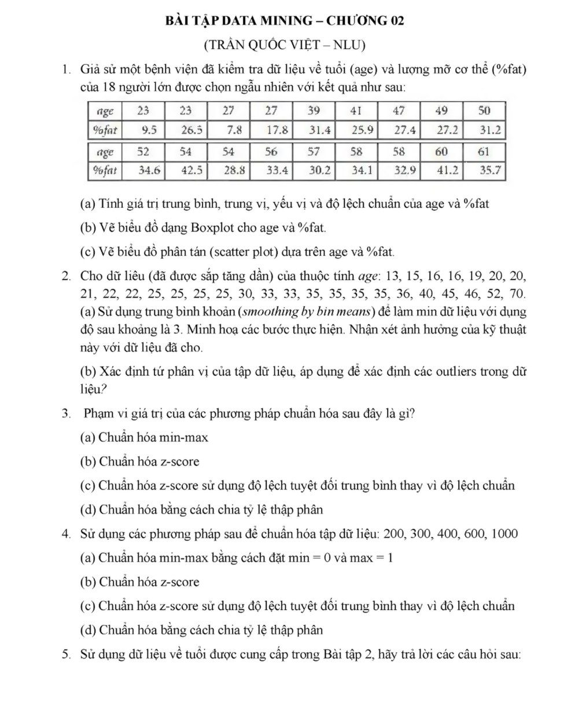
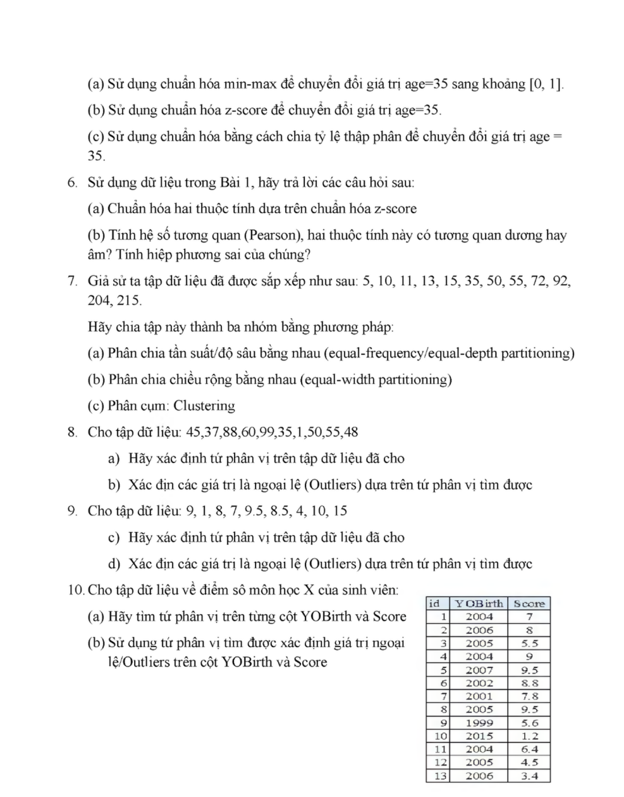
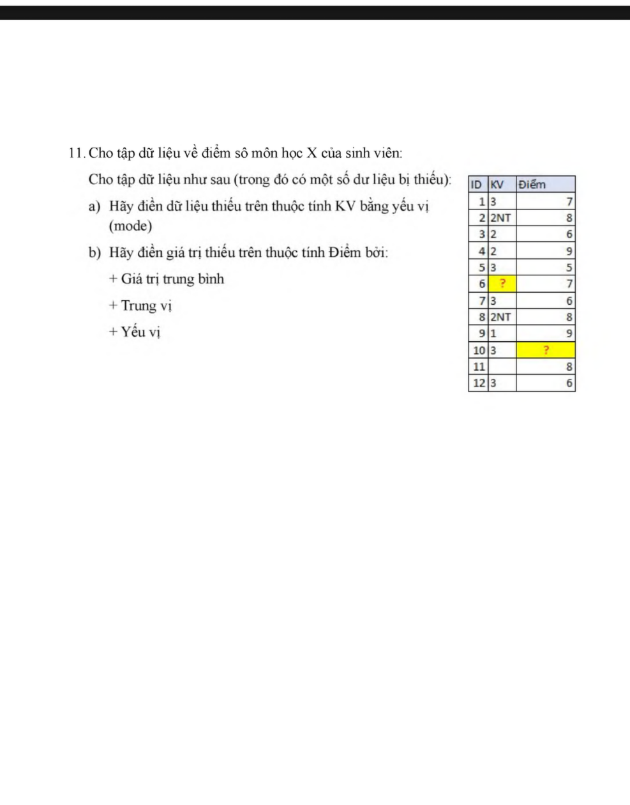

# Chương 02: Tiền Xử Lý Dữ Liệu (Data Preprocessing)

## I. Tổng Quan
Tiền xử lý dữ liệu là bước quan trọng trong Data Mining, giúp làm sạch và chuẩn hóa dữ liệu trước khi phân tích.

## II. Các Phương Pháp Chuẩn Hóa (Normalization)

### 1. Min-Max Normalization (Chuẩn hóa Min-Max)

**Công thức:**
```
v' = (v - min(A)) / (max(A) - min(A)) × (new_max - new_min) + new_min
```

**Trong đó:**
- `v`: Giá trị gốc
- `v'`: Giá trị sau chuẩn hóa
- `min(A)`: Giá trị nhỏ nhất của thuộc tính A
- `max(A)`: Giá trị lớn nhất của thuộc tính A
- `new_min`, `new_max`: Khoảng giá trị mới (thường là [0, 1])

**Ví dụ:** Chuẩn hóa age=35 sang khoảng [0, 1]
```
Giả sử: min(age) = 23, max(age) = 50
v' = (35 - 23) / (50 - 23) × (1 - 0) + 0
v' = 12 / 27 ≈ 0.44
```

### 2. Z-Score Normalization (Chuẩn hóa Z-Score)

**Công thức:**
```
v' = (v - μ) / σ
```

**Trong đó:**
- `μ` (mu): Giá trị trung bình (mean)
- `σ` (sigma): Độ lệch chuẩn (standard deviation)

**Cách tính:**
1. Tính mean: `μ = Σv / n`
2. Tính standard deviation: `σ = √[Σ(v - μ)² / n]`
3. Áp dụng công thức

**Đặc điểm:**
- Kết quả có mean = 0, std = 1
- Phù hợp khi dữ liệu tuân theo phân phối chuẩn
- Giữ được outliers

### 3. Decimal Scaling (Chuẩn hóa theo thập phân)

**Công thức:**
```
v' = v / 10^j
```

**Trong đó:**
- `j`: Số nguyên nhỏ nhất sao cho max(|v'|) < 1

**Ví dụ:**
```
Dữ liệu: 5, 10, 11, 13, 15, 35, 50, 55, 72, 92, 204, 215
max = 215 → cần chia cho 10^3 = 1000
v' = v / 1000
Kết quả: 0.005, 0.010, 0.011, ..., 0.204, 0.215
```

## III. Biểu Đồ Trực Quan (Visualization)

### 1. Boxplot (Biểu đồ hộp)

**Mục đích:** Phát hiện outliers

**Các thành phần:**
- **Q1 (Quartile 1)**: Tứ phân vị thứ nhất (25%)
- **Q2 (Median)**: Trung vị (50%)
- **Q3 (Quartile 3)**: Tứ phân vị thứ ba (75%)
- **IQR**: Interquartile Range = Q3 - Q1
- **Lower fence**: Q1 - 1.5 × IQR
- **Upper fence**: Q3 + 1.5 × IQR
- **Outliers**: Các điểm nằm ngoài fence

**Cách vẽ:**
1. Sắp xếp dữ liệu theo thứ tự tăng dần
2. Tìm Q1, Q2, Q3
3. Tính IQR
4. Xác định fence và outliers
5. Vẽ biểu đồ hộp

### 2. Scatter Plot (Biểu đồ phân tán)

**Mục đích:** Xem mối quan hệ giữa 2 biến

**Cách vẽ:**
- Trục X: Biến độc lập
- Trục Y: Biến phụ thuộc
- Mỗi điểm (x, y) là một bản ghi

## IV. Làm Mịn Dữ Liệu (Smoothing)

### 1. Smoothing by Bin Means (Làm mịn theo trung bình bin)

**Các bước:**
1. Sắp xếp dữ liệu
2. Chia thành các bin có độ sâu bằng nhau
3. Thay thế giá trị trong mỗi bin bằng giá trị trung bình của bin đó

**Ví dụ:**
```
Dữ liệu: 13, 15, 16, 16, 19, 20, 20, 21, 22, 22, 25, 25, 25, 25, 30
Chia thành 3 bins (mỗi bin 5 phần tử):

Bin 1: [13, 15, 16, 16, 19]
Mean = (13+15+16+16+19)/5 = 15.8
→ Bin 1 sau: [15.8, 15.8, 15.8, 15.8, 15.8]

Bin 2: [20, 20, 21, 22, 22]
Mean = 21
→ Bin 2 sau: [21, 21, 21, 21, 21]

Bin 3: [25, 25, 25, 25, 30]
Mean = 26
→ Bin 3 sau: [26, 26, 26, 26, 26]
```

### 2. Smoothing by Bin Boundaries (Làm mịn theo biên)

**Các bước:**
1. Sắp xếp dữ liệu
2. Chia thành các bin
3. Thay thế giá trị bằng giá trị gần nhất (min hoặc max của bin)

**Ví dụ:**
```
Bin 1: [13, 15, 16, 16, 19]
Min = 13, Max = 19
→ Bin 1 sau: [13, 13, 19, 19, 19]
```

## V. Phân Tích Và Xác Định Outliers

### Phương pháp Equal-Width Partitioning

**Công thức:**
```
Độ rộng mỗi bin = (max - min) / số lượng bins
```

### Phương pháp Equal-Depth Partitioning

**Cách thực hiện:**
- Mỗi bin chứa số lượng phần tử bằng nhau
- Số phần tử mỗi bin = tổng số phần tử / số bins

### Equal-Frequency Partitioning

Tương tự Equal-Depth, đảm bảo tần suất xuất hiện trong mỗi bin tương đương nhau.

### Clustering

Nhóm các giá trị gần nhau vào cùng một cluster.

## VI. Bài Tập Thực Hành

### Bài 1: Chuẩn hóa dữ liệu tuổi

**Đề bài:** Cho bảng dữ liệu age và %fat:

| age | 23 | 23 | 27 | 27 | 39 | 41 | 47 | 49 | 50 |
|-----|----|----|----|----|----|----|----|----|-----|
| %fat| 9.5| 26.5| 7.8| 17.8| 31.4| 25.9| 27.4| 27.2| 31.2|

**Câu a)** Tính giá trị trung bình, trung vị, yếu vị và độ lệch chuẩn của age và %fat

**Lời giải:**

**Cho age:**
- Dữ liệu đã sắp xếp: 23, 23, 27, 27, 39, 41, 47, 49, 50
- Mean (trung bình): μ = (23+23+27+27+39+41+47+49+50)/9 = 326/9 ≈ 36.22
- Median (trung vị): Vị trí thứ 5 = 39
- Mode (yếu vị): 23 và 27 (xuất hiện 2 lần)
- Std (độ lệch chuẩn):
  ```
  σ = √[Σ(v - μ)² / n]
  σ = √[((23-36.22)² + (23-36.22)² + ... + (50-36.22)²) / 9]
  σ ≈ 10.73
  ```

**Cho %fat:**
- Mean ≈ 22.74
- Median = 26.5
- Std ≈ 8.42

**Câu b)** Vẽ biểu đồ Boxplot cho age và %fat

**Lời giải:**

**Cho age:**

Dữ liệu đã sắp xếp: 23, 23, 27, 27, 39, 41, 47, 49, 50

**Bước 1: Tính các quartiles**

Với n = 9 giá trị:

- **Q2 (Median - Trung vị):** Vị trí thứ (n+1)/2 = (9+1)/2 = 5
  - Giá trị tại vị trí 5: **Q2 = 39**

- **Q1 (Tứ phân vị thứ nhất - 25%):** Vị trí thứ (n+1)/4 = (9+1)/4 = 2.5
  - Interpolation giữa vị trí 2 và 3:
  ```
  Q1 = (value[2] + value[3]) / 2
  Q1 = (23 + 27) / 2 = 50 / 2 = 25
  ```

- **Q3 (Tứ phân vị thứ ba - 75%):** Vị trí thứ 3(n+1)/4 = 3(9+1)/4 = 7.5
  - Interpolation giữa vị trí 7 và 8:
  ```
  Q3 = (value[7] + value[8]) / 2
  Q3 = (47 + 49) / 2 = 96 / 2 = 48
  ```

**Bước 2: Tính IQR (Interquartile Range)**

```
IQR = Q3 - Q1
IQR = 48 - 25 = 23
```

**Bước 3: Tính các giới hạn (fences)**

```
Lower fence = Q1 - 1.5 × IQR
Lower fence = 25 - 1.5 × 23
Lower fence = 25 - 34.5 = -9.5

Upper fence = Q3 + 1.5 × IQR
Upper fence = 48 + 1.5 × 23
Upper fence = 48 + 34.5 = 82.5
```

**Bước 4: Xác định outliers**

- Khoảng chấp nhận: [-9.5, 82.5]
- Kiểm tra các giá trị: 23, 23, 27, 27, 39, 41, 47, 49, 50
- Tất cả giá trị đều nằm trong khoảng [-9.5, 82.5]
- **Kết luận: Không có outliers**

**Câu c)** Vẽ biểu đồ phân tán (scatter plot) dựa trên age và %fat

**Lời giải:**
- Vẽ các điểm (age, %fat): (23, 9.5), (23, 26.5), (27, 7.8), ...
- Quan sát mối quan hệ giữa age và %fat

### Bài 2: Làm mịn dữ liệu

**Đề bài:** Cho dữ liệu age: 13, 15, 16, 16, 19, 20, 20, 21, 22, 22, 25, 25, 25, 25, 30, 33, 33, 35, 35, 35, 35, 36, 40, 45, 46, 52, 70

**Câu a)** Sử dụng trung bình khoảng (smoothing by bin means) với độ sâu khoảng là 3

**Lời giải:**
```
Bin 1: [13, 15, 16]
Mean = (13+15+16)/3 = 14.67
→ [14.67, 14.67, 14.67]

Bin 2: [16, 19, 20]
Mean = 18.33
→ [18.33, 18.33, 18.33]

... (tiếp tục cho các bins còn lại)
```

**Câu b)** Xác định và phân vị của phân vị, áp dụng để xác định các outliers trong dữ liệu

**Lời giải:**
```
n = 27
Q1 = giá trị ở vị trí (27+1)/4 = 7 → Q1 = 20
Q2 = giá trị ở vị trí (27+1)/2 = 14 → Q2 = 25
Q3 = giá trị ở vị trí 3(27+1)/4 = 21 → Q3 = 35
IQR = 35 - 20 = 15
Lower fence = 20 - 1.5×15 = -2.5
Upper fence = 35 + 1.5×15 = 57.5
Outliers: 70 (vượt quá upper fence)
```

### Bài 3: Chuẩn hóa min-max

**Đề bài:** Sử dụng các phương pháp sau để chuẩn hóa tập dữ liệu: 200, 300, 400, 600, 1000

**Câu a)** Chuẩn hóa min-max bằng cách đặt min = 0 và max = 1

**Lời giải:**
```
min = 200, max = 1000
v' = (v - 200) / (1000 - 200)

200 → (200-200)/800 = 0
300 → (300-200)/800 = 0.125
400 → (400-200)/800 = 0.25
600 → (600-200)/800 = 0.5
1000 → (1000-200)/800 = 1
```

### Bài 4: Chuẩn hóa z-score

**Câu b)** Chuẩn hóa z-score

**Lời giải:**
```
Mean μ = (200+300+400+600+1000)/5 = 500
Variance σ² = [(200-500)² + (300-500)² + (400-500)² + (600-500)² + (1000-500)²]/5
           = [90000 + 40000 + 10000 + 10000 + 250000]/5
           = 400000/5 = 80000
Std σ = √80000 ≈ 282.84

200 → (200-500)/282.84 ≈ -1.06
300 → (300-500)/282.84 ≈ -0.71
400 → (400-500)/282.84 ≈ -0.35
600 → (600-500)/282.84 ≈ 0.35
1000 → (1000-500)/282.84 ≈ 1.77
```

### Bài 5: Sử dụng dữ liệu về tuổi từ Bài 2

**Câu a)** Sử dụng chuẩn hóa min-max để chuyển đổi giá trị age=35 sang khoảng [0, 1]

**Lời giải:**
```
min = 13, max = 70
v' = (35 - 13) / (70 - 13) = 22 / 57 ≈ 0.386
```

**Câu b)** Sử dụng chuẩn hóa z-score để chuyển đổi giá trị age=35

**Lời giải:**
```
Tính mean và std của dữ liệu
μ ≈ 28.89
σ ≈ 13.52
v' = (35 - 28.89) / 13.52 ≈ 0.45
```

**Câu c)** Sử dụng chuẩn hóa bằng cách chia tỷ lệ thập phân để chuyển đổi giá trị age = 35

**Lời giải:**
```
max = 70 → cần j = 2 (vì 10^2 = 100 > 70)
v' = 35 / 100 = 0.35
```

### Bài 6: Sử dụng dữ liệu từ Bài 1

**Câu a)** Chuẩn hóa hai thuộc tính dựa trên chuẩn hóa z-score

**Lời giải:**
```
Đã tính ở Bài 1:
age: μ ≈ 36.22, σ ≈ 10.73
%fat: μ ≈ 22.74, σ ≈ 8.42

Áp dụng công thức z-score cho từng giá trị
```

**Câu b)** Tính hệ số tương quan (Pearson)

**Công thức Pearson:**
```
r = Σ[(x - μx)(y - μy)] / √[Σ(x - μx)² × Σ(y - μy)²]
```

Hoặc đơn giản hơn với dữ liệu đã chuẩn hóa z-score:
```
r = Σ(zx × zy) / n
```

### Bài 7: Phân chia dữ liệu thành bins

**Đề bài:** Cho dữ liệu: 5, 10, 11, 13, 15, 35, 50, 55, 72, 92, 204, 215

**Câu a)** Phân chia tần suất/độ sâu bằng nhau (equal-frequency/equal-depth partitioning)

**Lời giải:**
```
n = 12 điểm dữ liệu, chia thành 4 bins → mỗi bin có 3 phần tử

Bin 1: [5, 10, 11]
Bin 2: [13, 15, 35]
Bin 3: [50, 55, 72]
Bin 4: [92, 204, 215]
```

**Câu b)** Phân chia chiều rộng bằng nhau (equal-width partitioning)

**Lời giải:**
```
min = 5, max = 215
Độ rộng mỗi bin = (215 - 5) / 4 = 52.5

Bin 1: [5, 57.5) → {5, 10, 11, 13, 15, 35, 50, 55}
Bin 2: [57.5, 110) → {72, 92}
Bin 3: [110, 162.5) → {}
Bin 4: [162.5, 215] → {204, 215}
```

**Câu c)** Phân quan Clustering

**Lời giải:**
```
Nhóm các giá trị gần nhau:
Cluster 1: {5, 10, 11, 13, 15}
Cluster 2: {35, 50, 55}
Cluster 3: {72, 92}
Cluster 4: {204, 215}
```

### Bài 8-11: Xác định và xử lý outliers

**Các bước chung:**
1. Sắp xếp dữ liệu
2. Tính Q1, Q2, Q3
3. Tính IQR = Q3 - Q1
4. Xác định outliers: giá trị < Q1 - 1.5×IQR hoặc > Q3 + 1.5×IQR
5. Loại bỏ hoặc xử lý outliers

## VII. Tổng Kết

**Khi nào dùng phương pháp nào?**

| Phương pháp | Ưu điểm | Nhược điểm | Khi nào dùng |
|-------------|---------|------------|--------------|
| Min-Max | Giữ được khoảng giá trị | Nhạy cảm với outliers | Khi biết khoảng giá trị cụ thể |
| Z-Score | Không phụ thuộc khoảng giá trị | Yêu cầu phân phối chuẩn | Khi dữ liệu phân phối chuẩn |
| Decimal Scaling | Đơn giản | Mất thông tin | Khi cần chuẩn hóa nhanh |
| Bin Means | Giảm nhiễu tốt | Mất thông tin chi tiết | Khi có nhiều nhiễu |
| Bin Boundaries | Giữ được extreme values | Có thể tăng nhiễu | Khi cần giữ giá trị biên |

## VIII. Tài Liệu Tham Khảo




