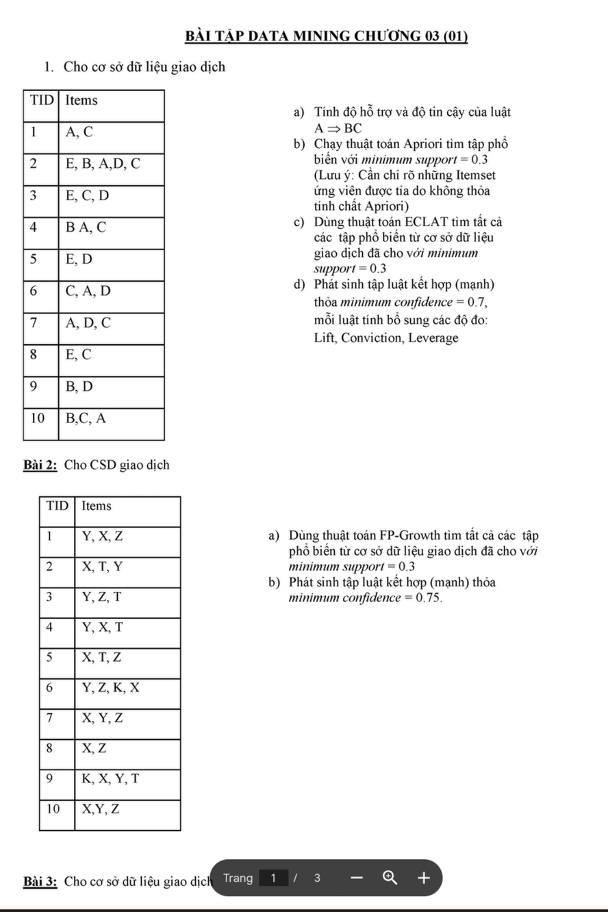
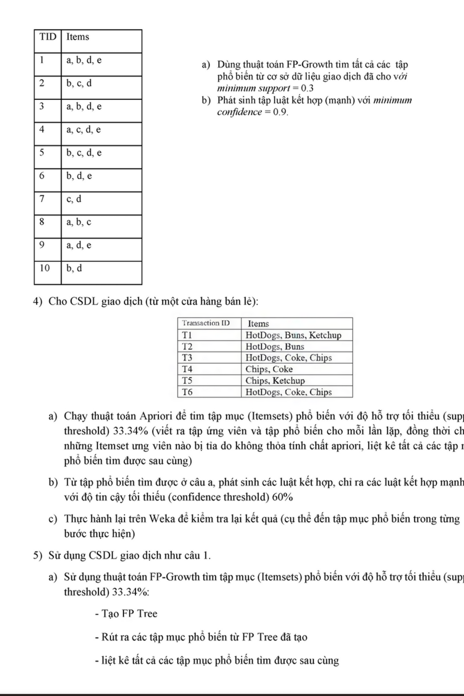

# Chương 03: Luật Kết Hợp - Association Rules

## I. Tổng Quan
Luật kết hợp (Association Rules) được sử dụng để tìm mối quan hệ giữa các items trong tập dữ liệu giao dịch.

**Ví dụ:** {Sữa, Bánh mì} → {Bơ} (Người mua sữa và bánh mì thường mua bơ)

## II. Các Khái Niệm Cơ Bản

### 1. Itemset
- **Item**: Một sản phẩm/đối tượng riêng lẻ (VD: A, B, C)
- **Itemset**: Tập hợp các items (VD: {A, B, C})
- **k-itemset**: Itemset chứa k items

### 2. Support (Độ hỗ trợ)

**Công thức:**
```
Support(X) = (Số giao dịch chứa X) / (Tổng số giao dịch)
Support(X → Y) = Support(X ∪ Y)
```

**Ví dụ:**
```
TID | Items
----|-------
1   | A, C
2   | E, B, A, D, C
...

Support({A, C}) = (Số giao dịch chứa cả A và C) / Tổng số giao dịch
```

### 3. Confidence (Độ tin cậy)

**Công thức:**
```
Confidence(X → Y) = Support(X ∪ Y) / Support(X)
```

**Ý nghĩa:** Xác suất xuất hiện Y khi đã có X

**Ví dụ:**
```
Confidence({Sữa} → {Bánh mì}) = Support({Sữa, Bánh mì}) / Support({Sữa})
```

### 4. Lift, Conviction, Leverage

**Lift (Độ nâng):**
```
Lift(X → Y) = Confidence(X → Y) / Support(Y)
            = Support(X ∪ Y) / (Support(X) × Support(Y))
```
- Lift > 1: X và Y có tương quan dương (xuất hiện cùng nhau)
- Lift = 1: X và Y độc lập
- Lift < 1: X và Y có tương quan âm

**Conviction:**
```
Conviction(X → Y) = (1 - Support(Y)) / (1 - Confidence(X → Y))
```

**Leverage:**
```
Leverage(X → Y) = Support(X ∪ Y) - Support(X) × Support(Y)
```

### 5. Minimum Support và Minimum Confidence

- **Minimum Support (min_sup)**: Ngưỡng tối thiểu để một itemset được coi là phổ biến
- **Minimum Confidence (min_conf)**: Ngưỡng tối thiểu để một luật được chấp nhận
- **Frequent Itemset**: Itemset có support ≥ min_sup

## III. Thuật Toán Apriori

### 1. Nguyên lý Apriori

**Tính chất:**
```
Nếu một itemset là phổ biến (frequent), 
thì tất cả các subset của nó cũng phải phổ biến.

Ngược lại: Nếu một itemset không phổ biến,
thì tất cả superset của nó cũng không phổ biến.
```

### 2. Các Bước Thuật Toán Apriori

**Bước 1: Tìm các frequent 1-itemsets**
```
- Quét database, đếm support của từng item
- Loại bỏ items có support < min_sup
- Kết quả: L₁ (tập frequent 1-itemsets)
```

**Bước 2: Sinh candidate k-itemsets (Cₖ)**
```
- Join step: Kết hợp các (k-1)-itemsets từ Lₖ₋₁
- Prune step: Loại bỏ candidates có subset không phổ biến
```

**Bước 3: Tính support và lọc**
```
- Quét database, tính support cho các candidates
- Lọc: Lₖ = {c ∈ Cₖ | support(c) ≥ min_sup}
```

**Bước 4: Lặp lại**
```
- Lặp lại bước 2-3 cho đến khi không còn frequent itemsets mới
```

### 3. Ví Dụ Chi Tiết Apriori

**Dữ liệu:**
```
TID | Items
----|-------
1   | A, C
2   | E, B, A, D, C
3   | E, C, D
4   | B, A, C
5   | E, D
6   | C, A, D
7   | A, D, C
8   | E, C
9   | B, D
10  | B, C, A
```

**Cho min_support = 0.3 (tức ≥ 3 giao dịch)**

**Iteration 1:**
```
Scan database, đếm support:

Item | Support Count
-----|---------------
A    | 6
B    | 4
C    | 8
D    | 6
E    | 4

L₁ = {{A}, {B}, {C}, {D}, {E}} (tất cả ≥ 3)
```

**Iteration 2:**
```
Join L₁ with L₁ → C₂:
C₂ = {{A,B}, {A,C}, {A,D}, {A,E}, {B,C}, {B,D}, {B,E}, 
      {C,D}, {C,E}, {D,E}}

Scan database, tính support:

Itemset | Support Count
--------|---------------
{A,B}   | 2  ✗
{A,C}   | 6  ✓
{A,D}   | 4  ✓
{A,E}   | 1  ✗
{B,C}   | 3  ✓
{B,D}   | 2  ✗
{B,E}   | 1  ✗
{C,D}   | 5  ✓
{C,E}   | 3  ✓
{D,E}   | 3  ✓

L₂ = {{A,C}, {A,D}, {B,C}, {C,D}, {C,E}, {D,E}}
```

**Iteration 3:**
```
Join L₂ with L₂ → C₃:
{A,C} + {A,D} → {A,C,D}
{A,C} + {B,C} → không (không cùng prefix)
{C,D} + {C,E} → {C,D,E}
{C,D} + {D,E} → {C,D,E}
{C,E} + {D,E} → {C,D,E}

C₃ = {{A,C,D}, {C,D,E}}

Prune: Kiểm tra subsets
{A,C,D}: subsets {A,C}, {A,D}, {C,D} đều ∈ L₂ ✓
{C,D,E}: subsets {C,D}, {C,E}, {D,E} đều ∈ L₂ ✓

Scan database, tính support:

Itemset  | Support Count
---------|---------------
{A,C,D}  | 3  ✓
{C,D,E}  | 2  ✗

L₃ = {{A,C,D}}
```

**Iteration 4:**
```
Join L₃ with L₃ → không thể (chỉ có 1 itemset)
→ Dừng
```

**Kết quả:**
```
Frequent itemsets:
L₁ = {{A}, {B}, {C}, {D}, {E}}
L₂ = {{A,C}, {A,D}, {B,C}, {C,D}, {C,E}, {D,E}}
L₃ = {{A,C,D}}
```

### 4. Sinh Luật Kết Hợp Từ Frequent Itemsets

**Với mỗi frequent itemset X:**
```
- Sinh tất cả các non-empty subsets s của X
- Với mỗi subset s:
  - Tạo luật: s → (X - s)
  - Tính confidence: conf = support(X) / support(s)
  - Nếu conf ≥ min_conf → chấp nhận luật
```

**Ví dụ:**
```
Cho frequent itemset {A, C, D} với support = 3/10 = 0.3

Subsets non-empty của {A,C,D}:
- {A} → {C,D}: conf = support({A,C,D}) / support({A}) = 0.3 / 0.6 = 0.5
- {C} → {A,D}: conf = 0.3 / 0.8 = 0.375
- {D} → {A,C}: conf = 0.3 / 0.6 = 0.5
- {A,C} → {D}: conf = 0.3 / 0.6 = 0.5
- {A,D} → {C}: conf = 0.3 / 0.4 = 0.75
- {C,D} → {A}: conf = 0.3 / 0.5 = 0.6

Nếu min_conf = 0.6:
Luật được chấp nhận:
- {A,D} → {C} (conf = 0.75)
- {C,D} → {A} (conf = 0.6)
```

## IV. Thuật Toán FP-Growth

### 1. Ưu điểm so với Apriori
- Không sinh candidates
- Chỉ quét database 2 lần
- Sử dụng FP-Tree (cấu trúc dữ liệu compact)
- Hiệu quả hơn với dữ liệu lớn

### 2. FP-Tree Structure

**Các thành phần:**
- **Root**: Gốc của cây (null)
- **Item nodes**: Các node chứa item và count
- **Node-links**: Liên kết các nodes cùng item
- **Header table**: Bảng chứa frequent items và link đến nodes

### 3. Các Bước FP-Growth

**Bước 1: Tạo Header Table**
```
1. Scan database lần 1, đếm support của từng item
2. Loại bỏ items có support < min_sup
3. Sắp xếp theo thứ tự giảm dần của support
```

**Bước 2: Xây dựng FP-Tree**
```
1. Scan database lần 2
2. Với mỗi transaction:
   - Sắp xếp items theo thứ tự trong header table
   - Chèn vào FP-Tree (tăng count nếu path đã tồn tại)
   - Cập nhật node-links
```

**Bước 3: Mining FP-Tree**
```
1. Với mỗi item i trong header table (từ dưới lên):
   - Tạo conditional pattern base
   - Tạo conditional FP-tree
   - Đệ quy tìm frequent itemsets
```

### 4. Ví Dụ Chi Tiết FP-Growth

**Dữ liệu:**
```
TID | Items
----|----------------
1   | Y, X, Z
2   | X, T, Y
3   | Y, Z, T
4   | Y, X, T
5   | X, T, Z
6   | Y, Z, K, X
7   | X, Y, Z
8   | X, Z
9   | K, X, Y, T
10  | X, Y, Z
```

**Cho min_support = 0.3 (≥ 3 giao dịch)**

**Bước 1: Header Table**
```
Scan database, đếm support:

Item | Count | Giữ lại?
-----|-------|----------
X    | 9     | ✓
Y    | 8     | ✓
Z    | 7     | ✓
T    | 5     | ✓
K    | 2     | ✗

Sắp xếp theo count giảm dần: X, Y, Z, T
```

**Bước 2: Xây dựng FP-Tree**
```
TID 1: {Y, X, Z} → sắp xếp: {X, Y, Z}
  Insert: root → X(1) → Y(1) → Z(1)

TID 2: {X, T, Y} → sắp xếp: {X, Y, T}
  Insert: root → X(2) → Y(2) → T(1)

TID 3: {Y, Z, T} → sắp xếp: {Y, Z, T}
  Insert: root → Y(1) → Z(1) → T(1)

... (tiếp tục cho các TIDs còn lại)

FP-Tree cuối cùng:
         root
        /    \
      X:8   Y:1
      |      |
     Y:7    Z:1
    / \      |
  Z:5  T:2  T:1
  |
 T:1
```

**Bước 3: Mining**

**Mining cho item T:**
```
Conditional pattern base cho T:
- {X, Y}: 2
- {X, Y, Z}: 1
- {Y, Z}: 1

Conditional FP-Tree cho T:
  X: 3, Y: 4, Z: 2 (không đủ min_sup = 3)
  
Frequent itemsets với T:
- {T}: 5
- {X, T}: 3
- {Y, T}: 4
- {X, Y, T}: 3
```

**Mining cho item Z:**
```
Conditional pattern base cho Z:
- {X, Y}: 5

Conditional FP-Tree cho Z:
  X: 5, Y: 5
  
Frequent itemsets với Z:
- {Z}: 7
- {X, Z}: 5
- {Y, Z}: 5
- {X, Y, Z}: 5
```

### 5. So Sánh Apriori và FP-Growth

| Tiêu chí | Apriori | FP-Growth |
|----------|---------|-----------|
| Số lần scan DB | Nhiều (k+1 lần cho k-itemsets) | 2 lần |
| Sinh candidates | Có | Không |
| Bộ nhớ | Ít hơn | Nhiều hơn (FP-Tree) |
| Tốc độ | Chậm với DB lớn | Nhanh hơn |
| Phù hợp | DB nhỏ, sparse | DB lớn, dense |

## V. Thuật Toán ECLAT

### 1. Nguyên lý
ECLAT (Equivalence Class Transformation) sử dụng vertical data format thay vì horizontal.

**Horizontal format (transaction list):**
```
TID | Items
----|-------
1   | A, C
2   | A, B, C
```

**Vertical format (TID list):**
```
Item | TID list
-----|----------
A    | {1, 2}
B    | {2}
C    | {1, 2}
```

### 2. Tính Support bằng Intersection

```
Support({A, C}) = |TID(A) ∩ TID(C)| / |Total transactions|
                = |{1, 2} ∩ {1, 2}| / 2
                = 2 / 2 = 1.0
```

### 3. Ưu điểm ECLAT
- Tính support nhanh hơn (intersection)
- Không cần scan database nhiều lần
- Phù hợp với dữ liệu sparse

## VI. Bài Tập Thực Hành

### Bài 1: Apriori cơ bản

**Đề bài:** Cho cơ sở dữ liệu giao dịch:

```
TID | Items
----|-------
1   | A, C
2   | E, B, A, D, C
3   | E, C, D
4   | B, A, C
5   | E, D
6   | C, A, D
7   | A, D, C
8   | E, C
9   | B, D
10  | B, C, A
```

**Câu a)** Tính độ hỗ trợ và độ tin cậy của luật A ⇒ BC

**Lời giải:**
```
Support(A) = 6/10 = 0.6
Support(BC) = 3/10 = 0.3
Support(ABC) = 2/10 = 0.2

Support(A → BC) = Support(A ∪ BC) = Support(ABC) = 0.2
Confidence(A → BC) = Support(ABC) / Support(A) = 0.2 / 0.6 = 0.33
```

**Câu b)** Chạy thuật toán Apriori tìm tập phổ biến với support ≥ 0.33

(Đã giải chi tiết ở phần III.3)

**Câu c)** Sử dụng danh sách các itemsets phổ biến tính chất Apriori

**Lời giải:**
```
Tính chất Apriori: Tất cả subsets của frequent itemset cũng phải frequent

Ví dụ:
- {A, C, D} là frequent
→ {A, C}, {A, D}, {C, D}, {A}, {C}, {D} đều phải frequent
```

**Câu d)** Phát sinh tập luật kết hợp (mash) thỏa minimum confidence = 0.7

**Lời giải:**
```
Từ {A, C, D}:
- {A, D} → {C}: conf = 0.3/0.4 = 0.75 ✓
- {C, D} → {A}: conf = 0.3/0.5 = 0.6 ✗
...

Lift, Conviction, Leverage:
Lift({A,D} → {C}) = 0.75 / 0.8 = 0.9375
```

### Bài 2: FP-Growth

**Đề bài:** Cho CSD giao dịch (như Bài 1)

**Câu a)** Dùng thuật toán FP-Growth tìm tất cả các tập phổ biến với minimum support = 0.3

**Lời giải:**
```
(Đã giải chi tiết ở phần IV.4)

Header table:
Item | Count
-----|------
C    | 8
A    | 6
D    | 6
E    | 4
B    | 4

Xây dựng FP-Tree và mining...
```

**Câu b)** Phát sinh tập luật kết hợp (mash) thỏa minimum confidence = 0.75

### Bài 3: FP-Growth với dữ liệu mới

**Đề bài:** Cho cơ sở dữ liệu giao dịch:

```
TID | Items
----|-------------
1   | a, b, d, e
2   | b, c, d
3   | a, b, d, e
4   | a, c, d, e
5   | b, c, d, e
6   | b, d, e
7   | c, d
8   | a, b, c
9   | a, d, e
10  | b, d
```

**Câu a)** Dùng thuật toán FP-Growth tìm tất cả các tập phổ biến với minimum support = 0.3

**Câu b)** Phát sinh tập luật kết hợp (mash) với minimum confidence = 0.9

### Bài 4: CSDL Giao Dịch Mới

**Đề bài:**
```
Transaction ID | Items
---------------|---------------------------
T1             | Bread, Milk, Ketchup
T2             | HotDogs, Buns
T3             | HotDogs, Coke, Chips
T4             | Chips, Coke
T5             | Chips, Ketchup
T6             | HotDogs, Coke, Chips
```

**Câu a)** Chạy thuật toán Apriori để tìm tập mục (itemsets) phổ biến với độ hỗ trợ tối thiểu (sup threshold) 33.34%

**Lời giải:**
```
min_sup = 2 giao dịch

L₁:
Bread: 1 ✗
Milk: 1 ✗
Ketchup: 2 ✓
HotDogs: 3 ✓
Buns: 1 ✗
Coke: 3 ✓
Chips: 4 ✓

L₁ = {{Ketchup}, {HotDogs}, {Coke}, {Chips}}

L₂:
{HotDogs, Coke}: 2 ✓
{HotDogs, Chips}: 2 ✓
{Coke, Chips}: 3 ✓
{Ketchup, Chips}: 1 ✗
...

L₂ = {{HotDogs, Coke}, {HotDogs, Chips}, {Coke, Chips}}

L₃:
{HotDogs, Coke, Chips}: 2 ✓

L₃ = {{HotDogs, Coke, Chips}}
```

**Câu b)** Từ tập phổ biến có kích thước lớn nhất, phát sinh tất cả luật kết hợp với độ tin cậy tối thiểu (confidence threshold) 60%

**Lời giải:**
```
Từ {HotDogs, Coke, Chips}:

{HotDogs} → {Coke, Chips}: conf = 2/3 = 0.67 ✓
{Coke} → {HotDogs, Chips}: conf = 2/3 = 0.67 ✓
{Chips} → {HotDogs, Coke}: conf = 2/4 = 0.5 ✗
{HotDogs, Coke} → {Chips}: conf = 2/2 = 1.0 ✓
{HotDogs, Chips} → {Coke}: conf = 2/2 = 1.0 ✓
{Coke, Chips} → {HotDogs}: conf = 2/3 = 0.67 ✓
```

**Câu c)** Thực hiện lại trên Weka để kiểm tra lại kết quả

### Bài 5: Sử dụng CSDL giao dịch như câu 1

**Câu a)** Sử dụng thuật toán FP-Growth tìm tập mục (itemsets) phổ biến với độ hỗ trợ tối thiểu (sup threshold) 33.34%

**Lời giải:**
```
- Tạo FP Tree
- Rút ra các tập mục phổ biến từ FP Tree đã tạo
```

## VII. Tổng Kết

### Khi nào dùng thuật toán nào?

| Tiêu chí | Apriori | FP-Growth | ECLAT |
|----------|---------|-----------|-------|
| Dữ liệu lớn | Chậm | Nhanh | Trung bình |
| Bộ nhớ | Ít | Nhiều | Trung bình |
| Dữ liệu sparse | Tốt | Kém hơn | Tốt |
| Dữ liệu dense | Kém | Tốt | Trung bình |
| Dễ hiểu | Dễ | Khó hơn | Trung bình |

### Các Độ Đo Quan Trọng

```
Support(X) = count(X) / total_transactions
Confidence(X → Y) = Support(X ∪ Y) / Support(X)
Lift(X → Y) = Confidence(X → Y) / Support(Y)
```

## VIII. Tài Liệu Tham Khảo



