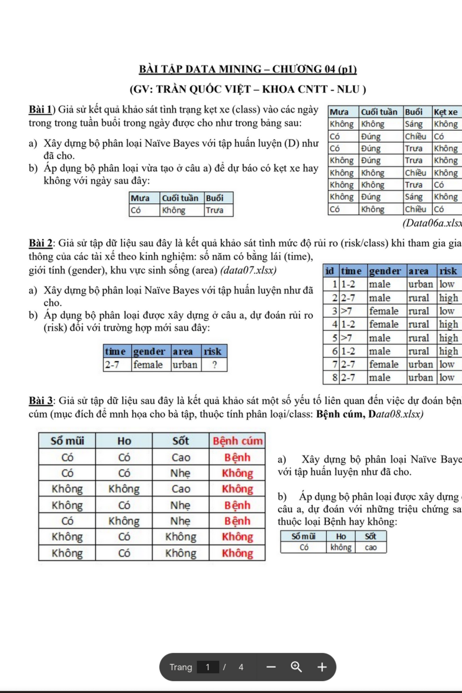
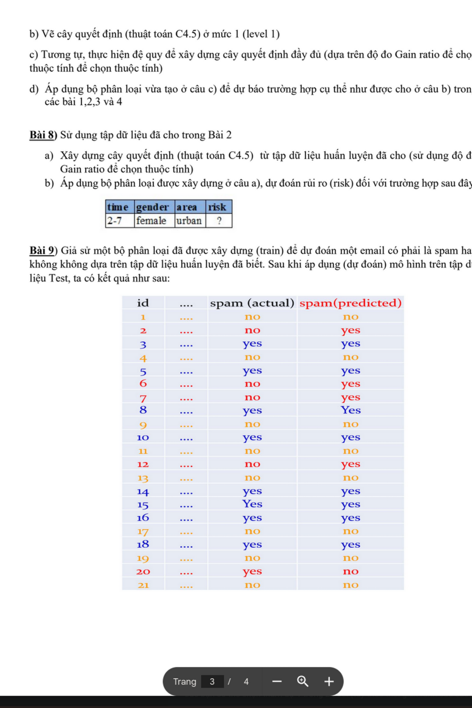
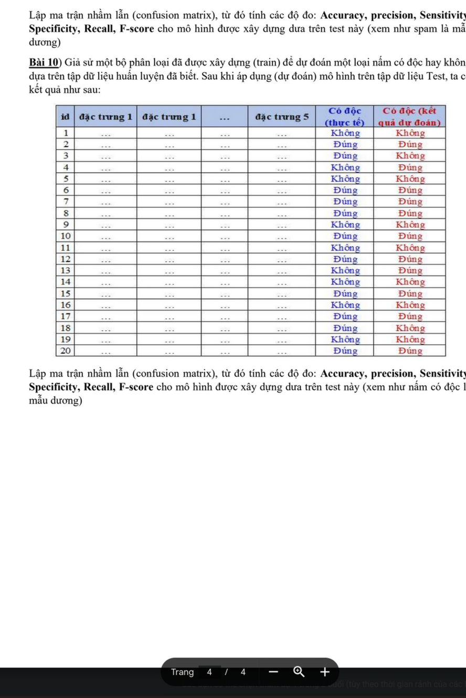
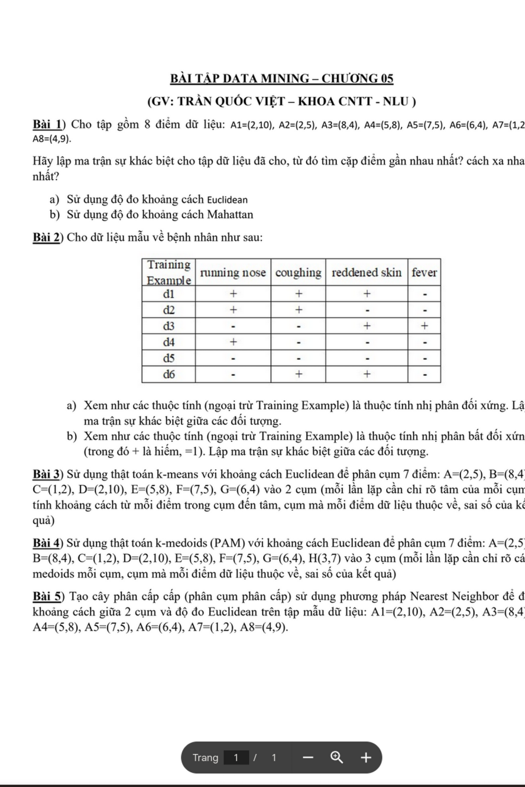

# Chương 04: Phân Loại - Classification

## I. Tổng Quan
Phân loại (Classification) là kỹ thuật supervised learning, dự đoán class label (nhãn lớp) của dữ liệu dựa trên training data.

**Ví dụ:** 
- Phân loại email: Spam / Not Spam
- Chẩn đoán bệnh: Cao / Trung bình / Thấp
- Dự đoán rủi ro: High / Medium / Low

## II. Naive Bayes Classifier

### 1. Định Lý Bayes

**Công thức:**
```
P(C|X) = [P(X|C) × P(C)] / P(X)
```

**Trong đó:**
- `P(C|X)`: Posterior probability - Xác suất lớp C khi đã biết dữ liệu X
- `P(X|C)`: Likelihood - Xác suất xuất hiện X khi thuộc lớp C
- `P(C)`: Prior probability - Xác suất ban đầu của lớp C
- `P(X)`: Evidence - Xác suất xuất hiện X (hằng số)

### 2. Naive Bayes Assumption

**Giả định:** Các thuộc tính độc lập với nhau (conditionally independent)

**Công thức mở rộng:**
```
P(C|X₁, X₂, ..., Xₙ) = P(C) × ∏ P(Xᵢ|C) / P(X)
                     = P(C) × P(X₁|C) × P(X₂|C) × ... × P(Xₙ|C) / P(X)
```

**Quyết định phân loại:**
```
Class = argmax P(C|X) = argmax P(C) × ∏ P(Xᵢ|C)
        C                C
```
(Bỏ qua P(X) vì là hằng số cho mọi class)

### 3. Các Loại Naive Bayes

#### a) Categorical Naive Bayes

Dùng cho dữ liệu danh mục (categorical data)

**Cách tính:**
```
P(Xᵢ = v | C) = count(Xᵢ = v và C) / count(C)
```

#### b) Gaussian Naive Bayes

Dùng cho dữ liệu liên tục (continuous data), giả định phân phối chuẩn

**Công thức:**
```
P(Xᵢ = x | C) = 1/(√(2π)σc) × exp(-(x - μc)²/(2σc²))
```

**Trong đó:**
- `μc`: Mean của Xᵢ trong class C
- `σc`: Standard deviation của Xᵢ trong class C

### 4. Laplace Smoothing (Add-one Smoothing)

**Vấn đề:** Nếu P(Xᵢ|C) = 0, toàn bộ tích bị = 0

**Giải pháp:**
```
P(Xᵢ = v | C) = [count(Xᵢ = v và C) + 1] / [count(C) + |V|]
```

**Trong đó:**
- `|V|`: Số lượng giá trị khác nhau của Xᵢ

### 5. Ví Dụ Chi Tiết

**Bài 1: Phân loại giới tính dựa vào Năng lượng, Tính năng, Năng động**

**Training Data:**
```
| Năng lượng | Tính năng | Năng động | Giới tính (Class) |
|------------|-----------|-----------|-------------------|
| Phong      | Phong     | Chậm      | Nam               |
| Không      | Phong     | Chậm      | Nữ                |
| Không      | Phong     | Chậm      | Nữ                |
| Không      | Phong     | Trữa      | Nữ                |
| Phong      | Phong     | Trữa      | Nam               |
| Không      | Phong     | Trữa      | Nữ                |
| Phong      | Phong     | Nhanh     | Nam               |
| Không      | Phong     | Nhanh     | Nữ                |
```

**Câu a)** Xây dựng mô hình Naive Bayes với tập dữ liệu này

**Lời giải:**

**Bước 1: Tính Prior Probability**
```
P(Nam) = 3/8 = 0.375
P(Nữ) = 5/8 = 0.625
```

**Bước 2: Tính Likelihood Probabilities**

**Với class Nam:**
```
P(Năng lượng = Phong | Nam) = 3/3 = 1.0
P(Năng lượng = Không | Nam) = 0/3 = 0

P(Tính năng = Phong | Nam) = 3/3 = 1.0

P(Năng động = Chậm | Nam) = 1/3 = 0.333
P(Năng động = Trữa | Nam) = 1/3 = 0.333
P(Năng động = Nhanh | Nam) = 1/3 = 0.333
```

**Với class Nữ:**
```
P(Năng lượng = Phong | Nữ) = 0/5 = 0
P(Năng lượng = Không | Nữ) = 5/5 = 1.0

P(Tính năng = Phong | Nữ) = 5/5 = 1.0

P(Năng động = Chậm | Nữ) = 3/5 = 0.6
P(Năng động = Trữa | Nữ) = 2/5 = 0.4
P(Năng động = Nhanh | Nữ) = 0/5 = 0
```

**Bước 3: Áp dụng mô hình**

**Câu b)** Áp dụng mô hình loại đoán danh mục của cầu thủ (rơi vào class nào) dự doanh mới với các thuộc tính:
```
Năng lượng = Không
Tính năng = Phong
Năng động = Trữa
```

**Lời giải:**
```
P(Nam | X) ∝ P(Nam) × P(Năng lượng=Không|Nam) × P(Tính năng=Phong|Nam) × P(Năng động=Trữa|Nam)
           = 0.375 × 0 × 1.0 × 0.333
           = 0

P(Nữ | X) ∝ P(Nữ) × P(Năng lượng=Không|Nữ) × P(Tính năng=Phong|Nữ) × P(Năng động=Trữa|Nữ)
          = 0.625 × 1.0 × 1.0 × 0.4
          = 0.25

→ Kết luận: Nữ (vì 0.25 > 0)
```

**Chú ý:** Do có giá trị 0, nên áp dụng Laplace smoothing sẽ chính xác hơn.

### Bài 2: Phân loại với Laplace Smoothing

**Câu a)** Xây dụng mô hình Naive Bayes với tập dữ liệu trên cho thuật tính Điểm bơn (với gender, tính area, risk, xem dữ liệu từ ảnh)

**Training Data:**
```
| gender | area   | risk |
|--------|--------|------|
| male   | urban  | low  |
| female | rural  | low  |
| female | rural  | low  |
| female | urban  | high |
| male   | rural  | high |
| female | urban  | high |
| male   | urban  | low  |
| male   | urban  | high |
```

**Lời giải:**

**Prior:**
```
P(low) = 4/8 = 0.5
P(high) = 4/8 = 0.5
```

**Likelihood (với Laplace smoothing):**
```
P(male | low) = (2+1)/(4+2) = 3/6 = 0.5
P(female | low) = (2+1)/(4+2) = 3/6 = 0.5

P(male | high) = (2+1)/(4+2) = 3/6 = 0.5
P(female | high) = (2+1)/(4+2) = 3/6 = 0.5

P(urban | low) = (2+1)/(4+2) = 3/6 = 0.5
P(rural | low) = (2+1)/(4+2) = 3/6 = 0.5

P(urban | high) = (3+1)/(4+2) = 4/6 = 0.667
P(rural | high) = (1+1)/(4+2) = 2/6 = 0.333
```

**Câu b)** Áp dụng mô hình loại đoán dựa vào xu dụng của cầu x, dự đoán rủi ro (risk) với đối tượng hợp lệ (ví dụ) trong bốn cơ bản 1,2,3 và 4

**Data point:**
```
gender = male
area = urban
```

**Lời giải:**
```
P(low | male, urban) ∝ P(low) × P(male|low) × P(urban|low)
                     = 0.5 × 0.5 × 0.5 = 0.125

P(high | male, urban) ∝ P(high) × P(male|high) × P(urban|high)
                      = 0.5 × 0.5 × 0.667 = 0.167

→ Kết luận: high (vì 0.167 > 0.125)
```

### Bài 3: Naive Bayes với Disease Class

**Đề bài:** Cho tập dữ liệu:

```
| Sổ mũi | Ho  | Sốt | Bệnh cúm |
|--------|-----|-----|----------|
| Có     | Có  | Cao | Bệnh     |
| Có     | Có  | Nhẹ | Không    |
| Không  | Có  | Cao | Không    |
| Không  | Không | Cao | Không    |
| Có     | Không | Nhẹ | Bệnh     |
| Không  | Có  | Không | Không    |
```

**Câu a)** Xây dựng mô hình Naive Bayes với tập dữ liệu này

**Lời giải:**

**Prior:**
```
P(Bệnh) = 2/6 = 0.333
P(Không) = 4/6 = 0.667
```

**Likelihood:**
```
P(Sổ mũi=Có | Bệnh) = 2/2 = 1.0
P(Ho=Có | Bệnh) = 1/2 = 0.5
P(Sốt=Cao | Bệnh) = 1/2 = 0.5
P(Sốt=Nhẹ | Bệnh) = 1/2 = 0.5

P(Sổ mũi=Có | Không) = 1/4 = 0.25
P(Ho=Có | Không) = 2/4 = 0.5
P(Sốt=Cao | Không) = 2/4 = 0.5
...
```

**Câu b)** Áp dụng mô hình loại được xây dựng ở câu a, dự đoán đối với người đến khám cá bệnh hợp lệ với 3 trường hợp trong cột bảng 1,2,3 và 4

(Áp dụng tương tự các bài trên)

### Bài 8: Quyết định với dữ liệu từ Bài 2

**Đề bài:** Sử dụng cây quyết định (toán toàn C4.5) để tập dữ liệu huấn luyện đã cho (sử dụng độ đỡ Gain ratio để chọn thử tính)

**Câu a)** Áp dụng cây quyết định với dữ liệu từ bài 2

(Xem phần Decision Trees bên dưới)

**Câu b)** Áp dụng bộ phân loại được xây dựng ở câu a), dự đoán rủi ro (risk) với đối tượng hợp lệ với trường hợp cột bảng

## III. Decision Trees (Cây Quyết Định)

### 1. Các Thuật Toán

- **ID3**: Information Gain
- **C4.5**: Gain Ratio (cải tiến của ID3)
- **CART**: Gini Index

### 2. Information Gain (ID3)

**Entropy (Độ hỗn loạn):**
```
Entropy(S) = -Σ pᵢ × log₂(pᵢ)
```

**Trong đó:**
- `pᵢ`: Tỷ lệ của class i trong tập S

**Information Gain:**
```
Gain(S, A) = Entropy(S) - Σ [|Sᵥ|/|S|] × Entropy(Sᵥ)
```

**Trong đó:**
- `A`: Thuộc tính
- `Sᵥ`: Tập con của S có giá trị v cho thuộc tính A

**Chọn thuộc tính:** Thuộc tính có Gain cao nhất

### 3. Gain Ratio (C4.5)

**Split Information:**
```
SplitInfo(S, A) = -Σ [|Sᵥ|/|S|] × log₂(|Sᵥ|/|S|)
```

**Gain Ratio:**
```
GainRatio(S, A) = Gain(S, A) / SplitInfo(S, A)
```

**Ưu điểm:** Tránh bias với thuộc tính có nhiều giá trị

### 4. Gini Index (CART)

**Gini Index:**
```
Gini(S) = 1 - Σ pᵢ²
```

**Gini Gain:**
```
GiniGain(S, A) = Gini(S) - Σ [|Sᵥ|/|S|] × Gini(Sᵥ)
```

**Chọn thuộc tính:** Thuộc tính có Gini Gain cao nhất (hoặc Gini thấp nhất)

### 5. Ví Dụ Chi Tiết

**Bài 1: Training Example**

**Data:**
```
| Training Example | running nose | coughing | reddened skin | fever |
|------------------|--------------|----------|---------------|-------|
| d1               | +            | +        | +             | -     |
| d2               | +            | +        | +             | +     |
| d3               | +            | -        | -             | +     |
| d4               | -            | +        | +             | -     |
| d5               | -            | -        | -             | -     |
| d6               | -            | +        | +             | +     |
```

**Câu a)** Xem như các trường tính (ngoại trừ Training Example) là thuộc tính nhị phân đối xứng. Lập ma trận tương tự phân đối xỏng. Lá ma trận sử khác biệt giữa các đối tượng.

**Ma trận tương tự (similarity matrix):**
```
     | d1 | d2 | d3 | d4 | d5 | d6 |
-----|----|----|----|----|----|----|
d1   | 4  | 3  | 2  | 2  | 0  | 2  |
d2   | 3  | 4  | 2  | 2  | 0  | 2  |
d3   | 2  | 2  | 4  | 1  | 1  | 1  |
d4   | 2  | 2  | 1  | 4  | 2  | 3  |
d5   | 0  | 0  | 1  | 2  | 4  | 2  |
d6   | 2  | 2  | 1  | 3  | 2  | 4  |
```

(Giá trị là số thuộc tính giống nhau)

**Câu b)** Lập ma trận tương tự phân biệt 2 trong các đối tương.

## IV. Model Evaluation (Đánh Giá Mô Hình)

### 1. Confusion Matrix (Ma Trận Nhầm Lẫn)

**Cấu trúc:**
```
                    Predicted
                | Positive | Negative |
----------------|----------|----------|
Actual Positive |    TP    |    FN    |
Actual Negative |    FP    |    TN    |
```

**Trong đó:**
- **TP (True Positive)**: Dự đoán đúng Positive
- **TN (True Negative)**: Dự đoán đúng Negative
- **FP (False Positive)**: Dự đoán sai Positive (Type I Error)
- **FN (False Negative)**: Dự đoán sai Negative (Type II Error)

### 2. Các Độ Đo

**Accuracy (Độ chính xác):**
```
Accuracy = (TP + TN) / (TP + TN + FP + FN)
```

**Precision (Độ chính xác dương):**
```
Precision = TP / (TP + FP)
```
Trong số những cái dự đoán là Positive, bao nhiêu % đúng?

**Recall / Sensitivity (Độ nhạy):**
```
Recall = TP / (TP + FN)
```
Trong số những cái thực tế là Positive, bao nhiêu % được phát hiện?

**Specificity (Độ đặc hiệu):**
```
Specificity = TN / (TN + FP)
```

**F1-Score:**
```
F1 = 2 × (Precision × Recall) / (Precision + Recall)
```

### 3. Ví Dụ Spam Detection

**Đề bài:** Giá sử một bộ phân loại dùng để dự đoán xây dựng mô hình email có phải là spam hay không (spam = yes, không bơn spam = no), khi sử dụng dữ liệu trên test này (xem ảnh) thì có kết quả như sau

**Kết quả:**
```
| id | spam (actual) | spam(predicted) |
|----|---------------|-----------------|
| 1  | no            | no              |
| 2  | no            | no              |
| 3  | yes           | yes             |
| 4  | no            | yes             |
| 5  | yes           | yes             |
| 6  | yes           | yes             |
| 7  | no            | yes             |
| 8  | yes           | Yes             |
| 9  | no            | no              |
| 10 | yes           | yes             |
| 11 | no            | yes             |
| 12 | no            | yes             |
| 13 | yes           | yes             |
| 14 | yes           | yes             |
| 15 | Yes           | yes             |
| 16 | yes           | yes             |
| 17 | no            | no              |
| 18 | yes           | yes             |
| 19 | no            | no              |
| 20 | yes           | no              |
| 21 | no            | no              |
```

**Lập ma trận nhầm lẫn (confusion matrix):**

**Lời giải:**

**Đếm:**
```
Actual yes, Predicted yes (TP) = 10
Actual yes, Predicted no (FN) = 1
Actual no, Predicted yes (FP) = 6
Actual no, Predicted no (TN) = 4
```

**Confusion Matrix:**
```
                | Predicted Yes | Predicted No |
----------------|---------------|--------------|
Actual Yes      |      10       |      1       |
Actual No       |       6       |      4       |
```

**Tính các độ đo:**
```
Accuracy = (10 + 4) / 21 = 14/21 = 0.667 = 66.7%

Precision = 10 / (10 + 6) = 10/16 = 0.625 = 62.5%

Recall = 10 / (10 + 1) = 10/11 = 0.909 = 90.9%

Specificity = 4 / (4 + 6) = 4/10 = 0.4 = 40%

F1-Score = 2 × (0.625 × 0.909) / (0.625 + 0.909)
         = 2 × 0.568 / 1.534
         = 0.740 = 74%
```

### Bài 10: Multi-class Confusion Matrix

**Đề bài:** Cho sổ một bộ phân loại đoàn dựng dùng cho xây kết luận lại sắc dữ liệu bổi việc bán thể tự sử dụng dữ liệu từ trên test đã nhận. Sau khi sử dụng (tả thể) mô hình trên tập 4 đảo dài được sự mô hình được sử (xem màu đếm gộp câu đốc 1 kêt (tờ 1 mau đương)

**Cho confusion matrix với nhiều classes:**

```
        | Đúng (thực tế) | Không (thực tế) |
--------|----------------|-----------------|
Đúng    | ?              | ?               |
Không   | ?              | ?               |
```

## V. K-Nearest Neighbors (KNN)

### 1. Nguyên lý

KNN là thuật toán lazy learning (không có training phase)

**Các bước:**
1. Tính khoảng cách từ điểm cần dự đoán đến tất cả điểm training
2. Chọn k điểm gần nhất
3. Voting: Class xuất hiện nhiều nhất trong k điểm được chọn

### 2. Distance Metrics

**Euclidean Distance:**
```
d(x, y) = √[Σ(xᵢ - yᵢ)²]
```

**Manhattan Distance:**
```
d(x, y) = Σ|xᵢ - yᵢ|
```

**Minkowski Distance:**
```
d(x, y) = (Σ|xᵢ - yᵢ|ᵖ)^(1/p)
```
- p = 1: Manhattan
- p = 2: Euclidean

### 3. Chọn giá trị K

- K nhỏ: Nhạy cảm với nhiễu
- K lớn: Mượt hơn nhưng mất thông tin local
- K tốt: Thường là √n (n = số điểm training)

## VI. Tổng Kết

### So Sánh Các Thuật Toán

| Thuật toán | Ưu điểm | Nhược điểm | Khi nào dùng |
|------------|---------|------------|--------------|
| Naive Bayes | Nhanh, đơn giản | Giả định độc lập | Dữ liệu categorical, text classification |
| Decision Tree | Dễ hiểu, không cần chuẩn hóa | Dễ overfitting | Dữ liệu có rule rõ ràng |
| KNN | Đơn giản, không cần training | Chậm khi predict | Dữ liệu nhỏ, không có outliers |

## VII. Tài Liệu Tham Khảo





